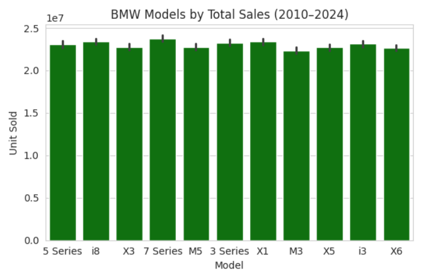
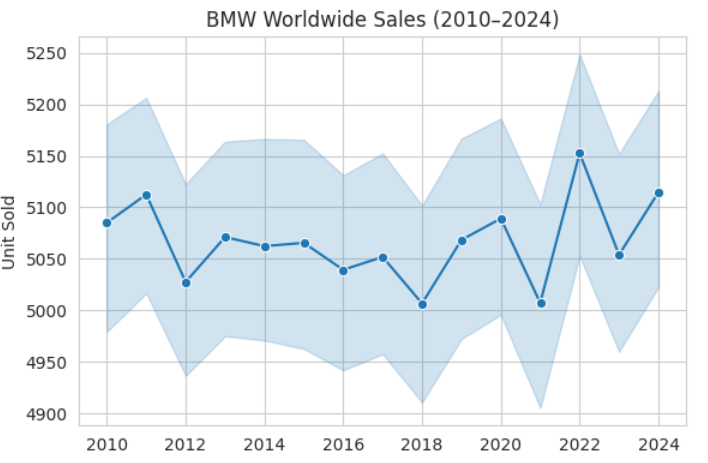
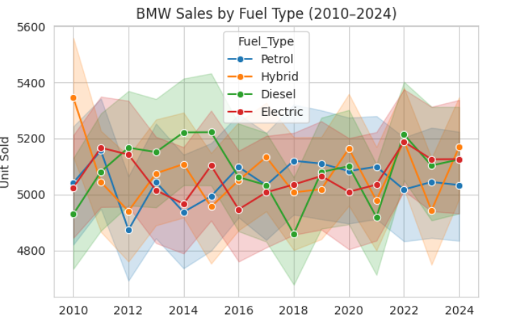
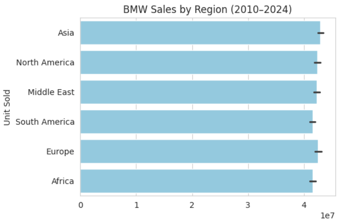
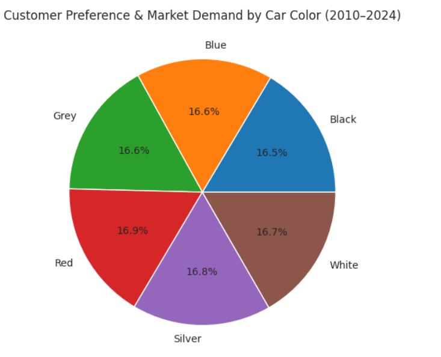

# BMW Worldwide Sales Analysis (2010–2024)

This repository contains an exploratory data analysis (EDA) of **BMW worldwide sales records from 2010 to 2024**.  
The project aims to uncover insights about sales trends, customer preferences, and market demand using Python (Seaborn, Matplotlib, Pandas).  

---

## 📌 Project Objectives
- Analyze yearly sales performance of BMW cars worldwide.  
- Identify **top-selling BMW models** over time.  
- Compare **sales volume across regions**.  
- Understand **fuel type trends** (Petrol, Diesel, Hybrid, Electric).  
- Explore **customer preferences based on car color**.  
- Visualize insights with clean, easy-to-understand charts.  

---

## 📊 Visualizations

The following insights are included in this analysis:

1. **Total Sales by BMW Model (2010–2024)**  
   

2. **Worldwide Sales Trend (2010–2024)**  
   

3. **Sales by Fuel Type (2010–2024)**  
   

4. **Sales by Region (2010–2024)**  
   

5. **Customer Preference & Market Demand by Car Color (2010–2024)**  
   

---

## 🛠️ Tools & Libraries
- Python 3  
- Pandas  
- Matplotlib  
- Seaborn  
- Google Colab  

---

## 📑 Dataset
The dataset was obtained from **Kaggle**:  
👉 [BMW Worldwide Sales Dataset](https://www.kaggle.com/datasets/ahmadrazakashif/bmw-worldwide-sales-records-20102024)  

> Note: The dataset is not included in this repository due to size. Please download it from Kaggle.

---

## ▶️ Run on Google Colab
You can open and run the notebook directly in Google Colab:  

---

## 📌 Key Insights
- **Sales Trend:** BMW sales remained relatively stable with fluctuations between 2010–2024.  
- **Models:** The **5 Series and 7 Series** are among the most sold models.  
- **Regions:** Europe and North America are the largest markets for BMW.  
- **Fuel Types:** Increasing demand for **Hybrid and Electric** vehicles in recent years.  
- **Colors:** Popular customer choices include **Black, White, and Silver**.  

---

## 📜 License
This project is for **educational and portfolio purposes only**.  
Dataset © Kaggle contributors.
